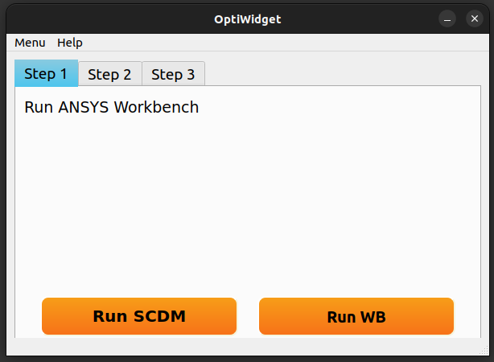

# Ansys SpaceClaim python scripts
This is an unfinished project.

## 1. pyQt_draft_template
A boiler plate to test pyQt features. You could set path to Ansys SpaceClaim/Workbench and play them by your own needs.

## 2. scripts
Some python scripts, that you could use in Ansys SpaceClaim/Workbench
to slice, format, improve coordinate of wing sections.

### **Requrements**
* Python 3.5
    - glob
    - numpy
* Ansys 19.4  (v194 tested)
    - SpaceClaim
    - Workbench

### **TODO**

-  requirements

-  pictures

### **Disclaimer**
These scripts are provided “as is” and any express or implied warranties, including the implied warranties of merchantability and fitness for a particular purpose are disclaimed. In no event shall I or contributors be liable for any direct, indirect, incidental, special, exemplary, or consequential damages (including, but not limited to, loss of use, data, or profits; or business interruption) sustained by you or a third party, however caused and on any theory of liability, whether in contract, strict liability, or tort arising in any way out of the use of this sample code, even if advised of the possibility of such damage.